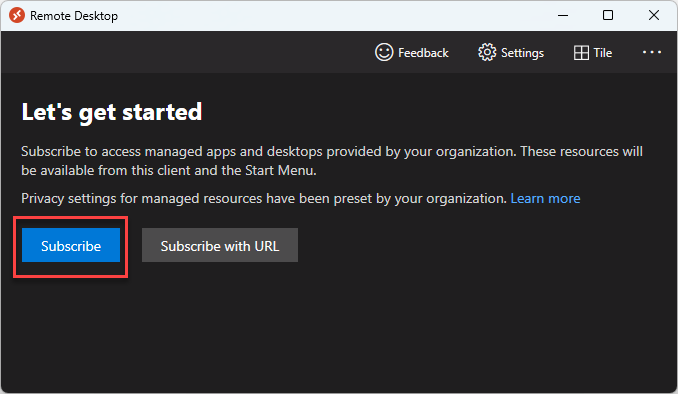
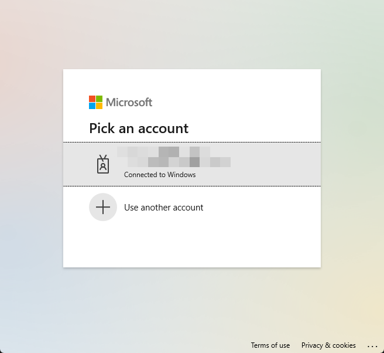
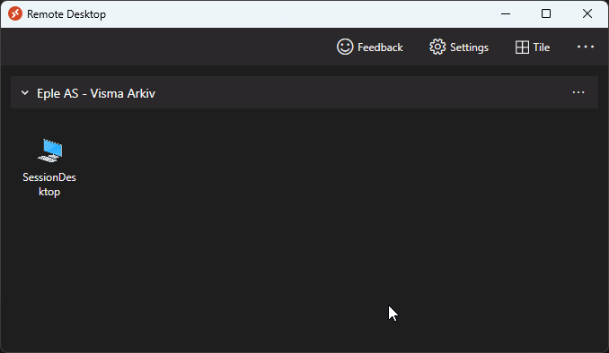
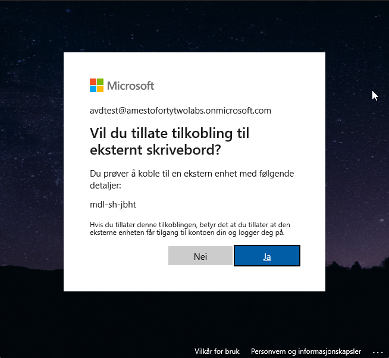
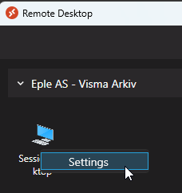
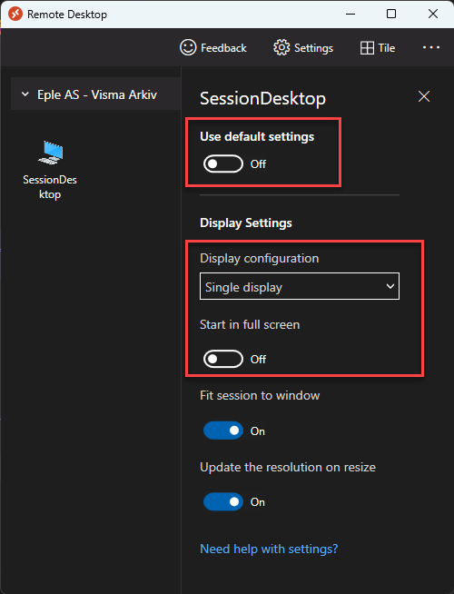

# End user Documentation for Managed Desktop Light

## Pre-requisites

The Azure Virtual Desktop client is available for Windows, MacOS, iOS, Android and HTML5.
The client is available from this page: [Azure Virtual Desktop clients](https://learn.microsoft.com/en-us/azure/virtual-desktop/users/connect-windows?tabs=subscribe "Azure Virtual Desktop clients")

**_NB!_** Printing is **_NOT_** supported in the HTML5 client.

## Introduction

Connecting from the Azure Virtual Desktop client is quite simple, you click on subscribe, and the client will pop-up an authentication window. You need to authenticate with your EntraID account (if MFA is required this will also pop-up), and then you will see the available resources.

### Connecting

The first time you login to the sessionDesktop, you will be asked to authenticate again. You will also be asked to grant the Azure Virtual User Login permission to the sessionDesktop. This is needed to be able to login to the sessionDesktop.

You can also adjust the settings for the sessionDesktop, by right clicking on the sessionDesktop and select "Settings".

If you ie. want to have the sessionDesktop in just a window, and not full screen, you can adjust this in the settings.

